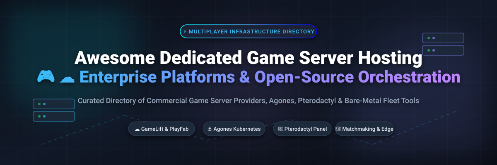

# Awesome Dedicated Game Server Hosting 🎮 ☁️

  

  
  
  
  
  
  

---

## 🌟 Top Dedicated Game Server Hosting Ecosystem

**Curated List of Commercial Game Server Platforms & Open-Source Orchestration Tools** 🎮  
*Focused on Multiplayer Server Orchestration, Matchmaking, Autoscaling, Bare-Metal Deployment & Self-Hosted Game Server Management* 🚀

**Last updated: October 2026** 📅

---

### 📌 Overview & SEO Summary

Welcome to the definitive curated directory of **dedicated game server hosting platforms**, **open-source game server orchestration software**, and **multiplayer backend infrastructure frameworks**. Whether you are building an indie multiplayer game or operating AAA live-service titles requiring enterprise managed fleets (such as *Microsoft PlayFab*, *Amazon GameLift*, and *Google Cloud Agones*), or searching for self-hostable open-source control panels (like *Pterodactyl Panel*, *LinuxGSM*, and *itzg Docker Minecraft*), this list covers category leaders, containerized game servers, zero-egress providers, and edge multiplayer infrastructure.

**Key Market Context & Highlights:** 💡

- 🔷 **Microsoft PlayFab Multiplayer Servers** & ☁️ **Amazon GameLift** lead enterprise cloud game server hosting with massive global scalability, Spot instance discounts up to 70%, and built-in matchmaking.
- ⚓ **Agones** (a CNCF project backed by Google Cloud) is the **leading open-source Kubernetes-native game server orchestration platform**, serving as the foundation for modern cloud-native game hosting.
- 🦖 **Pterodactyl Panel** provides **isolated Docker container management** for game servers with out-of-the-box support for Minecraft, Rust, CS2, and 40+ popular games.
- 🎯 **Gameye**, ⚡ **Edgegap**, and 🚀 **Hathora** lead the new wave of **zero-egress and serverless edge game server orchestration**, cutting bandwidth costs while optimizing player latency under 50ms.

---

## 📑 Table of Contents

- [🏢 SaaS & Commercial Platforms](#-saas--commercial-platforms)
- [🔓 Open-Source GitHub Projects](#-open-source-github-projects)
- [🛠️ How to Contribute](#%EF%B8%8F-how-to-contribute)
- [📊 Star History](#-star-history)
- [🤝 Support & Sponsorship](#-support--sponsorship)
- [⚠️ Disclaimer](#%EF%B8%8F-disclaimer)

---

## 🏢 SaaS & Commercial Platforms

📈 **Market Analysis & Overview:** The global dedicated game server hosting & orchestration market is estimated at **$7.2 Billion** (growing at a 14.5% CAGR through 2030). The sector is **moderately fragmented**: hyperscale cloud providers (Microsoft Azure, AWS, Google Cloud) dominate foundational compute infrastructure, while specialized orchestrators and edge platforms (Gameye, Hathora, Edgegap, AccelByte) compete aggressively on zero bandwidth egress fees, sub-50ms latency deployment, and serverless developer experience.

*Sorted by Company Size / Market Cap / Valuation (Descending)* 📊

| SaaS / Commercial Platform | Company / Owner | Valuation / Market Cap | Standard Edition Starting Price | Free Tier / Free Trial Limits | Description |
| :--- | :--- | :--- | :--- | :--- | :--- |
| **[PlayFab Multiplayer Servers](https://playfab.com/)** 🔷 | Microsoft | ~$3.90 Trillion | **$0.252/VM-hour** (D2v2 instance in US East) + **$0.087/GB egress** | **750 free Dasv4 core hours/month + 10 GB egress per region** | **Azure-native game server hosting** — Dynamically scaling pool of custom game servers with automated fleet expansion, global deployment, and integrated LiveOps. |
| **[Amazon GameLift](https://aws.amazon.com/gamelift/)** ☁️ | Amazon | ~$2.0 Trillion | **$0.042/hour** (c5.large On-Demand) or **$0.013/hour** (Spot instance) | **AWS Free Tier: 750 hours/month of c3.large for 12 months + 50 GB data transfer** | **AWS-native game server hosting** — Managed EC2 and container fleets with automatic scaling, FlexMatch session placement, and Spot instance pricing for up to 70% savings. |
| **[Agones on GKE](https://cloud.google.com/game-servers)** 🌐 | Google Cloud | ~$2.0 Trillion | **$0.10/cluster-hour** (GKE control plane) + **$0.0475/vCPU-hour** (e2-standard compute) | **$300 free credits for 90 days + 1 free zonal GKE cluster per account** | **Managed Agones on GKE** — Google Cloud Game Servers fully manages Agones Kubernetes clusters for autoscaling dedicated game server fleets. |
| **[Unity Multiplay](https://unity.com/solutions/gaming-services)** 🎮 | Rocket Science Group / Unity | ~$12.5 Billion | **$0.0316/core-hour** (Linux in us-central1) / **$0.046/hour** (Windows base license) | **$800 initial registration credit for 90 days** | **Enterprise game server hosting & orchestration** — Hybrid bare-metal + cloud fleet scaling across global locations with custom matchmaker integration. |
| **[Nitrado Enterprise](https://nitrado.net/)** 🇩🇪 | Nitrado (marbis GmbH) | ~$150 Million | **€15.99/month** (Enterprise 10-slot dedicated server) | **3-day full-feature test server trial upon request** | **European game server hosting** — Enterprise bare-metal infrastructure, specialized DDoS mitigation, and 24/7 technical support. |
| **[AccelByte](https://accelbyte.io/)** 🟢 | AccelByte | ~$60 Million | **$0.198/VM-hour** (2 vCPU, 4 GB RAM) + **$0.102/GB network egress** | **Free trial: 888 VM hours + 50 GB egress + 15 GB log storage** | **Full-stack gaming backend with server hosting** — Extend application hosting for standardized VMs bundled with player account management. |
| **[Edgegap](https://edgegap.com/)** ⚡ | Edgegap | ~$15 Million | **$0.015/session-hour** (1 vCPU, 2 GB RAM edge node) | **Free forever tier: 5 concurrent active game server instances + 1,000 monthly session hours** | **Automated edge server orchestration** — Managed Kubernetes game server clusters delivering under-50ms latency using containerized workloads. |
| **[Gameye](https://gameye.com/)** 🎯 | Gameye | ~$10 Million | **$0.07/vCPU/hour** (On-demand compute) / **$2.00/vCPU/month** (BYOI self-hosted) | **Free developer sandbox access with 100 free server hours upon signup** | **Zero-egress fee game server orchestration** — No bandwidth charges, per-second billing, and multi-provider failover across 21 cloud/bare-metal networks. |
| **[Hathora](https://hathora.dev/)** 🚀 | Hathora | ~$8 Million | **$0.04/hour** per active server instance (1 vCPU, 2 GB RAM) | **Free tier: $5.00 monthly recurring credit (~125 free server hours per month)** | **Serverless game server hosting** — Container-native deployment with global edge presence, automatic scaling, and zero infrastructure management. |
| **[DatHost](https://dathost.com/)** 🎮 | DatHost | ~$5 Million | **€14.90/month** (Valheim/CS2 dedicated server, 16 GB DDR5, NVMe) | **14-day 100% money-back guarantee + 1-hour free instant test server** | **High-performance game server host** — Specialized for Valheim, CS2, Rust, and custom Linux server binaries with 2 Tbps DDoS protection. |

---

## 🔓 Open-Source GitHub Projects

*Sorted by GitHub Stars_Count (Descending)* 🌟

- **[itzg/docker-minecraft-server](https://github.com/itzg/docker-minecraft-server)**   
  **Docker image for Minecraft dedicated server**, MIT licensed. **14K+ GitHub_Stars** — Features automatic server download, modpack support (Forge, Fabric, Paper, Spigot), configuration via environment variables, and seamless containerization. 🐳

- **[Nakama](https://github.com/heroiclabs/nakama)**   
  **Open-source game backend server**, Apache-2.0 licensed. **13K+ GitHub_Stars** — Provides real-time multiplayer, matchmaking, user accounts, social chat, leaderboards, and cloud save. Extensible via Lua, Go, and TypeScript. 🐉

- **[Pterodactyl Panel](https://github.com/pterodactyl/panel)**   
  **Game server management panel with Docker isolation**, MIT licensed. **9K+ GitHub_Stars** — Runs game servers in isolated Docker containers with strict resource limits. Supports Minecraft, Rust, CS2, TF2, and 40+ games out of the box with web console and multi-node allocation. 🦖

- **[Colyseus](https://github.com/colyseus/colyseus)**   
  **Multiplayer game server framework for Node.js**, MIT licensed. **7K+ GitHub_Stars** — State-synchronization framework for TypeScript/JavaScript game servers with room-based matchmaking and SDKs for Unity, Unreal, Construct, and HTML5. ⚔️

- **[Agones](https://github.com/agones-dev/agones)**   
  **Kubernetes-native game server orchestration**, Apache-2.0 licensed. **7K+ GitHub_Stars** — **CNCF project** extending Kubernetes with Custom Resource Definitions (CRDs) to host, scale, and manage dedicated game server processes globally across any cloud or bare metal. ⚓

- **[LinuxGSM](https://github.com/GameServerManagers/LinuxGSM)**   
  **Command-line tool for Linux dedicated game servers**, MIT licensed. **4.9K+ GitHub_Stars** — Quick and simple deployment, management, and monitoring for 120+ Linux dedicated game servers (Valheim, CS2, ARK, Rust, TF2). 🐧

- **[Open Match](https://github.com/googleforgames/open-match)**   
  **Flexible, extensible matchmaking framework**, Apache-2.0 licensed. **3.4K+ GitHub_Stars** — **CNCF project** designed to integrate with Agones for complete multiplayer dedicated server placement and matchmaking logic. 🎯

- **[Pitaya](https://github.com/topfreegames/pitaya)**   
  **Scalable, distributed game server framework**, MIT licensed. **2.8K+ GitHub_Stars** — Written in Go with clustering support, RPC communications, and client libraries for Unity, iOS, Android, and C. 🚀

- **[PufferPanel](https://github.com/pufferpanel/pufferpanel)**   
  **Open-source game server management panel**, Apache-2.0 licensed. **1.7K+ GitHub_Stars** — Lightweight web console written in Go for managing game server instances for personal networks and community hosters. 🎛️

- **[Kruise-Game](https://github.com/openkruise/kruise-game)**   
  **Game Server Workload Management on Kubernetes**, Apache-2.0 licensed. **1K+ GitHub_Stars** — Cloud-native Kubernetes operator tailored for game server state management, warm-up pools, and in-place updates. 🎮

- **[Open Game Panel](https://github.com/OpenGamePanel/OGP-Website)**   
  **Classic web-based game server control panel**, GPL-2.0 licensed. **130+ GitHub_Stars** — Agent-based remote control system utilizing lightweight Perl agents for server administration and XML game configs. 🕹️

- **[Space Agon](https://github.com/googleforgames/space-agon)**   
  **Agones + Open Match integration reference demo**, Apache-2.0 licensed. **50+ GitHub_Stars** — End-to-end open-source multiplayer server demo demonstrating dedicated server orchestration on GKE. 🌌

- **[GameServerKeeper](https://github.com/GameServerKeeper/GameServerKeeper)**   
  **Game server management and orchestration**, open-source. **50+ GitHub_Stars** — Container-based game server deployment with automated health checks and fleet scaling. 🛠️

---

## 🛠️ How to Contribute

Contributions are warmly welcomed! Follow these steps to submit new game server hosting platforms, SaaS solutions, or open-source orchestration tools:

1. 🍴 **Fork** this repository.
2. 📝 **Add or update** entries in `README.md` keeping the standard Markdown table & list formatting.
3. 🔗 Include exact pricing details, free tier limits, company valuation/market cap, and Stars_Count badges.
4. 🚀 Submit a **Pull Request** with a brief summary of your additions.

---

## 📊 Star History

---

## 🤝 Support & Sponsorship

If you find this **Awesome Dedicated Game Server Hosting** resource helpful for your game development journey, please consider supporting the project:

- ⭐ **Star** this repository on GitHub to help others discover it!
- 🔀 **Fork & Share** with fellow developers, infrastructure engineers, and open-source advocates.
- ☕ **Buy Me a Coffee / Sponsor**: Support ongoing open-source curation and maintenance via the [GitHub Sponsor Dashboard](https://github.com/sponsors/ishandutta2007).

---

## ⚠️ Disclaimer

- This directory is a **community-curated list** — provided for informational purposes only. ℹ️
- **SaaS pricing and cloud instance rates** (such as AWS GameLift, Azure PlayFab, and Google GKE) fluctuate based on region, spot availability, and usage volume. Always consult official pricing pages prior to production deployment.
- **Zero bandwidth egress pricing** (offered by providers like Gameye) can significantly reduce operational costs for high-throughput multiplayer game servers.
- **Open-source orchestration software** (such as Agones, Pterodactyl, and Kruise-Game) requires container infrastructure (Kubernetes or Docker) and ongoing maintenance. Conduct thorough testing prior to production launch. 🎮

---

  <b>Made with ❤️ for game developers, infrastructure engineers, and open-source game server advocates.</b>

